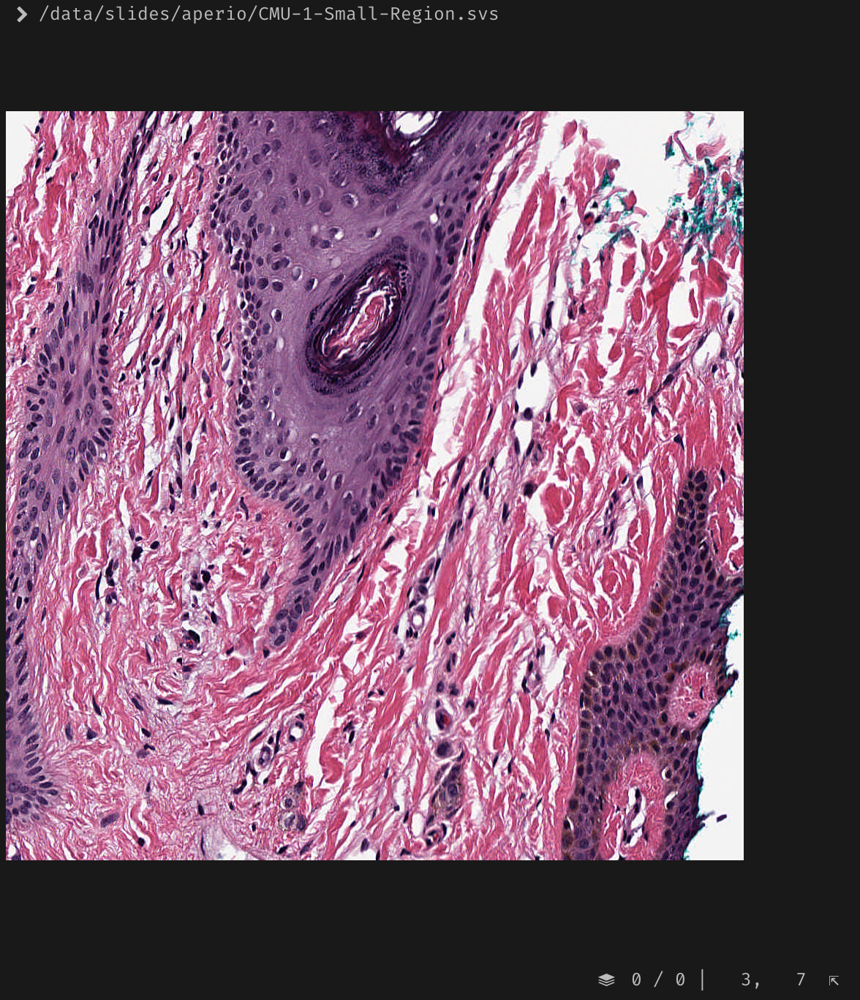

# wsi-tvx

Whole slide image - terminal viewer.

Refactor of `wsi-tv`, with focus on clarity, caching.




## Installation

```bash
make
```

## Usage

```bash
./bin/wsi-tvx <slidepath>
```

## Keys

- `q` - quit
- `r` - reload
- `d` - toggle debug info
- `t` - toggle thumbnail

- `j` / `↓` - down
- `k` / `↑` - up
- `l` / `←` - right
- `h` / `→` - left
- `i` - zoom in ( keeps top left constant )
- `o` - zoom out ( keeps top left constant )

## Limitations

- Needs terminal support for [kitty image protocol](https://sw.kovidgoyal.net/kitty/graphics-protocol/).
- Terminal needs to respond to `\x1b[14t` request for pixel dimensions.
- Only tested on Linux.
- Not optimal base64
  - Use [race64](https://github.com/skeeto/race64) for base64 encoding ( with SIMD optimizations ).
  - However, we convert RGBA to RGB to send less info ( 25% lesser than original for each tile ).

## Issues

- Crashes sometimes, use `r` to reset.

## Tests

```bash
make test
```
